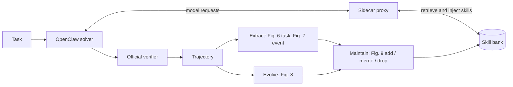

<div align="center">

# CODESKILL Rebuild

**An independent, from-scratch reproduction of [CODESKILL: Learning Self-Evolving Skills for Coding Agents](https://arxiv.org/abs/2605.25430)**

[](https://arxiv.org/abs/2605.25430)
[](pyproject.toml)
[](LICENSE)
[](docs/STATUS.md)

[Overview](#overview) •
[How it works](#how-it-works) •
[Progress](#progress) •
[Findings so far](#findings-so-far) •
[Quick start](#quick-start) •
[Repository layout](#repository-layout) •
[Citation](#citation)

</div>

> [!IMPORTANT]
> This is **not** the authors' implementation, and it has **not** reproduced the paper's results.
> So far there is no evidence that the extracted skills help the downstream agent. This README
> reports what works, what does not, and what we are fixing.

## News

- **2026-09-28** — Re-extracting skills with the paper's original prompts, an identifier lint, and
  compact trajectories. Offline retrieval evaluation found and fixed the retrieval-query bugs. A
  10-task SWE-bench Verified pilot ran; its orchestration scripts are not in this repository yet.
- **2026-09-10** — First public snapshot: the full pipeline runs end to end on Terminal-Bench 2.

## Overview

CODESKILL trains a small *manager* model that turns coding-agent trajectories into reusable
**skills**. Each skill is a short instruction note:

- a `title` and a `granularity` (a *task-level* workflow, or an *event-driven* reaction to an error
  or a test result);
- a `when_to_apply` condition;
- a list of `rules`.

The manager extracts, evolves, and maintains a skill bank. A frozen solver agent receives the
relevant skills through retrieval, and gets better on later tasks.

This repository rebuilds that loop from the paper alone:

| | Paper | This rebuild |
|---|---|---|
| Manager | Qwen3.5-4B trained with SFT + GRPO | **Untrained** DeepSeek-V4-Flash driven by prompts |
| Solver | Qwen3.5-35B-A3B / GPT-5.4-mini with mini-SWE-agent | DeepSeek-V4-Flash in [OpenClaw](https://github.com/openclaw/openclaw) via [Harbor](https://github.com/harbor-framework/harbor) |
| Benchmarks | SWE-bench Verified, Terminal-Bench 2, and others | SWE-bench Verified (main), Terminal-Bench 2 |
| Skill operations | Fig. 6–9: task extraction, event extraction, evolution, maintenance | Same four operations |
| Retrieval | all-MiniLM-L6-v2, same-instance exclusion | Same, plus an optional LLM relevance check |

Without training, this setup corresponds to the paper's **Prompt Skill Mgmt.** baseline, not to the
trained CODESKILL policy. On SWE-bench Verified the paper reports that baseline close to the
trained manager: +7.3 vs +8.7 points with Qwen3.5-35B-A3B as the solver, and +10.0 vs +9.3 with
GPT-5.4-mini. That makes it a meaningful target. A line-by-line comparison with the paper is in
[docs/PAPER_ALIGNMENT.md](docs/PAPER_ALIGNMENT.md).

## How it works



- **Injection without modifying OpenClaw.** OpenClaw talks to a per-trial sidecar proxy, which
  adds task skills to the first request and event skills after tool results. A small OpenClaw
  plugin ([openclaw_plugin/](openclaw_plugin/)) handles native context compaction. OpenClaw itself
  is not forked or patched.
- **No leakage.** The bank is frozen before each task. Skills extracted from a task, or derived
  from it, are never retrieved for that same task.
- **Traceability.** Manager calls, bank updates, and runs record their inputs, outputs, git commit,
  and config hashes.

## Progress

The order is agreed: fix retrieval, then extraction quality, then training-free feedback. RL comes
last and only if the earlier steps work.

- [x] End-to-end pipeline on Terminal-Bench 2; a 10-task SWE-bench Verified pilot
- [x] Offline replay of retrieval on recorded trajectories; query bugs fixed
- [x] Second-stage relevance check after MiniLM retrieval (implemented; evaluated offline only)
- [ ] **Extraction quality** *(running)*: paper-original Fig. 6/7 prompts, an identifier lint,
  compact trajectories, and Fig. 9 maintenance on top
- [ ] Skill quality scoring with the paper's rubric (Fig. 10–13) as an offline verifier
- [ ] Training-free feedback: per-skill usage and outcome statistics
- [ ] Paired no-skill vs. skill solver runs on the same runtime
- [ ] RL, only if the solver still does not improve once retrieval and skill quality are sound
- [ ] Everyday use: an OpenClaw plugin/hook usable outside benchmarks

## Findings so far

| Question | Current answer | Evidence |
|---|---|---|
| Do skills improve the solver? | **Unknown.** Two solver runs exist (TB2: 12 tasks × 2 rounds; SWE-bench Verified: 10-task pilot). Neither can be interpreted: there was no same-runtime control, the samples were small, and 20–30% of task outcomes flip between identical reruns. | [EXPERIMENTS §1](docs/EXPERIMENTS.md) |
| Were the injected skills relevant? | **No.** All 13 event-skill injections in the SWE pilot were off-topic, both to the manager and to manual review. | [STATUS](docs/STATUS.md) |
| Why? (retrieval) | Task queries were built from harness boilerplate instead of the issue text. Event queries used the *head* of tool output, while errors sit at the end. After the fix, hit@1 on relevant moments rose from 0.09 to 1.00 (SWE) and from 0.62 to 0.92 (TB2). | [EXPERIMENTS §3](docs/EXPERIMENTS.md) |
| Why? (skills) | Custom prompts had relaxed the paper's ban on task-specific identifiers. The skills became one-off patch recipes: function names, file paths. A lint and the original prompts are being tested now. | [STATUS](docs/STATUS.md) |
| Does a relevance check help? | In offline evaluation, MiniLM top-3 followed by an LLM check raised SWE precision from 0.03 to 0.40 and cut injections by 14×. No solver run has used it yet. | [EXPERIMENTS §3](docs/EXPERIMENTS.md) |

## Quick start

Requires Python 3.12 or newer.

```bash
git clone https://github.com/rayyichen310/codeskill-rebuild.git
cd codeskill-rebuild
python -m pip install -e ".[task-graph]" httpx pytest
PYTHONPATH=src PYTHONUTF8=1 python -m unittest discover -s tests -v
```

The offline tests use fake managers and fixtures. They check pipeline behavior and provenance, not
skill quality or task success. Known failing tests are listed in [docs/STATUS.md](docs/STATUS.md).

The live pipelines need more than this repository:

- an OpenAI-compatible model endpoint: copy `configs/model-endpoints.example.json` to
  `configs/model-endpoints.json`, which git ignores;
- OpenClaw and Harbor for solver runs;
- your own trajectories. Raw traces are not published.

The main entry points are listed in [docs/ARCHITECTURE.md §3](docs/ARCHITECTURE.md).

## Repository layout

```text
src/codeskill_rebuild/  library: skill bank, retrieval, manager client, trace import,
                        OpenClaw proxy and overlay, compact traces, skill lint
scripts/                entry points: extraction runners, offline evaluations, run drivers
prompts/paper/          Fig. 6–9 prompts transcribed from the paper
prompts/custom/         project prompt variants, each documented in its README
openclaw_plugin/        OpenClaw plugin used together with the sidecar proxy
configs/                run profiles and the endpoint example
tests/                  offline tests
docs/                   status, decisions, paper alignment, architecture, experiments
```

## Documentation

The design documents are written in Traditional Chinese.

| Document | Contents |
|---|---|
| [STATUS](docs/STATUS.md) | Current state, known problems, next steps |
| [DECISIONS](docs/DECISIONS.md) | Decisions in force and open questions |
| [PAPER_ALIGNMENT](docs/PAPER_ALIGNMENT.md) | Paper vs. implementation, item by item |
| [ARCHITECTURE](docs/ARCHITECTURE.md) | Modules, entry points, data flow |
| [EXPERIMENTS](docs/EXPERIMENTS.md) | Every run, its settings and results |
| [docs/archive/](docs/archive/) | Superseded specifications, decision logs, and reviews |

## Citation

If you use this work, please cite the original paper:

```bibtex
@article{li2026codeskill,
  title   = {CODESKILL: Learning Self-Evolving Skills for Coding Agents},
  author  = {Li, Yanzhou and Zhang, Yiran and Zhang, Xiaoyu and Liu, Xiaoxia and Liu, Yang},
  journal = {arXiv preprint arXiv:2605.25430},
  year    = {2026}
}
```

## License

Code in this repository is released under the [MIT License](LICENSE). The prompts in
`prompts/paper/` are transcribed from the CODESKILL paper and belong to its authors.

## Acknowledgements

- CODESKILL by Li et al. for the method and the prompts in its appendix.
- [OpenClaw](https://github.com/openclaw/openclaw), [Harbor](https://github.com/harbor-framework/harbor),
  [Terminal-Bench](https://www.tbench.ai/), and [SWE-bench](https://www.swebench.com/) for the agent
  and the benchmarks.
