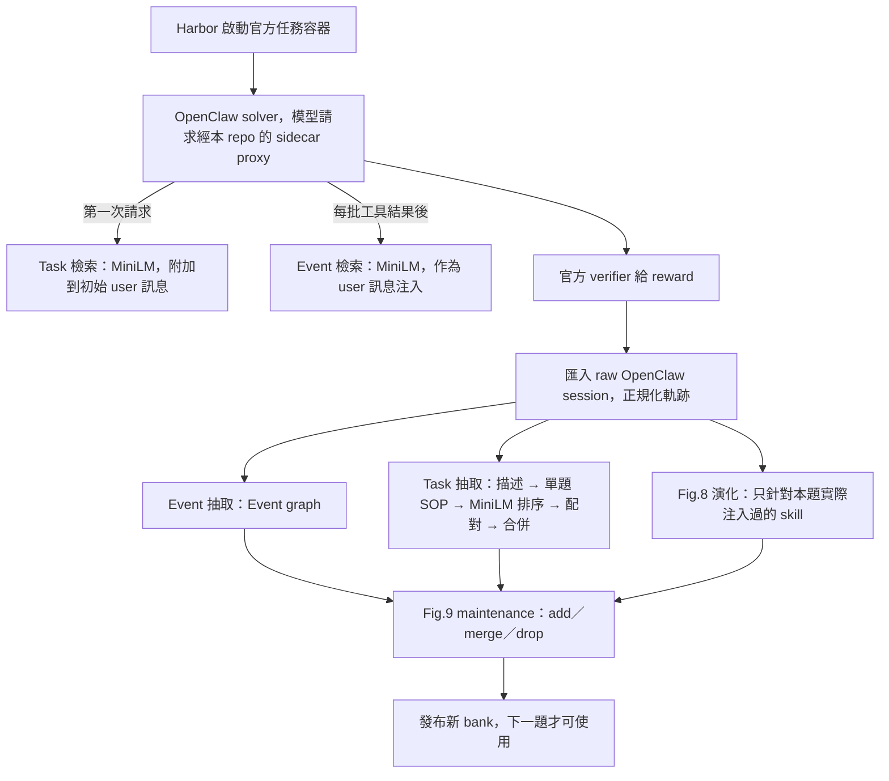

# 系統架構與執行方式

更新：2026-09-28。合併自已封存的 IMPLEMENTATION_STATUS、task-langgraph、
R015_C_ONLY_CODING_PREPARATION、CONNECTIONS、TRACE_REUSE（見 `docs/archive/`）。
本檔描述程式「怎麼運作」；方法與論文的差異見 `docs/PAPER_ALIGNMENT.md`。

## 1. 資料流（C 組，一題）



- 每題開始前凍結 bank；同一題所有 trial 結束後才發布更新。
- 同題（含祖先來源）產生的 skill 不可被該題檢索。

## 2. 模組地圖（`src/codeskill_rebuild/`）

| 角色 | 模組 |
|---|---|
| 方法核心 | `bank.py`（版本化 bank、add／merge／drop transaction、來源排除）、`retrieval.py`（MiniLM、欄位 token 配額、query 組法）、`pipeline.py`（Fig.6–9 訊息組裝與輸出解析）、`evolution.py`、`event_extraction.py`（R012 的 3 次 event 排程）、`arm_banks.py`（B／C 候選分庫） |
| R015 抽取 | `event_graph.py`、`event_graph_stages.py`、`task_graph.py`、`task_graph_stages.py`、`task_graph_model.py`、`task_sop.py`、`shared_segments.py`、`segment_candidates.py`、`code_examples.py` |
| Manager 呼叫 | `manager.py`（DeepSeek client、ledger、輸出分類）、`manager_projection.py`（軌跡的 lossless JSON 投影、thinking 保留／排除）、`context.py`、`compaction.py`（超長時的切段摘要）、`manager_reconciliation.py` |
| 軌跡 | `traces.py`（匯入 OpenClaw session）、`r015_harbor_evidence.py`（匯入 Harbor trial） |
| OpenClaw 整合 | `openclaw_proxy.py`、`openclaw_overlay.py`（在 request 邊界注入 task／event 區塊）、`openclaw_sidecar_retrieval.py`（凍結 bank 的檢索）、`openclaw_compaction.py`、`sqlite_compaction.py`、`openclaw_native_summary.py`、`native_compaction_common.py`（偵測原生 compaction，放行摘要請求） |
| Harbor | `harbor_openclaw_adapter.py`、`harbor_environment_probe.py`、`harbor_recovery.py` |
| 協定與排程 | `c_only_protocol.py`（兩輪 C-only 狀態機）、`trial_schedule.py`（每題凍結 bank）、`r012_execution.py`、`r012_runtime.py`、`development_runner.py` |
| 其他 | `runtime.py`、`solver_probe.py`、`pairing_audit.py`、`types.py` |

程式規模（2026-09-28）：src 約 1.6 萬行、scripts 約 1.8 萬行、tests 約 1.75 萬行。
直接對應論文方法的核心（bank、retrieval、evolution、event_extraction、manager）約 1.5k 行，
其餘多為 provenance、復原與整合。

## 3. 入口腳本

現行（R015）：

| 腳本 | 用途 |
|---|---|
| `scripts/run_r015_c_only.py` | 兩輪 C-only campaign 協調器。`prepare`、`check` 安全；`start` 需 `--confirm-user-start` |
| `scripts/run_r015_c_only_harbor_driver.py` | 單一 trial：Harbor + sidecar + 抽取 + 發布（5,182 行） |
| `scripts/run_openclaw_r012_sidecar.py` | 啟動單一 trial 的 sidecar proxy；`--check-config` 驗設定 |
| `scripts/run_r015_four_task_diagnostic.py` | 只跑第 1 輪前 4 題的診斷版 |
| `scripts/prepare_r015_c_only_harbor_recovery.py`、`reconcile_r015_c_only_manager.py`、`replay_r015_saved_manager_outputs.py`、`import_r015_harbor_trial.py` | 中斷後的復原、對帳、重放 |
| `scripts/create_public_snapshot.py` | 產生可公開的脫敏快照 |
| `src/codeskill_rebuild/retrieval_query.py`、`relevance_judge.py` | P2 查詢組法與 Jev 相關性判斷；sidecar 在 profile 有 `p2_selection` 時使用（`configs/p2-selection.json`） |
| `scripts/eval_retrieval_offline.py` | 離線重放 task／event 檢索（只用本機 MiniLM，不呼叫模型）；結果見 EXPERIMENTS §3 |
| `scripts/eval_relevance_judge.py` | 在上述重放結果上呼叫 Jev 做相關性判斷（外部 API，key 在 `~/.config/codeskill/typesafe.env`）；回應全部快取 |

歷史（M1–M3 時期，保留供重現舊 run）：`run_m2_*`、`run_m3_*`、`derive_r010_common_banks.py`、
`import_m2_sources.py`、`resume_m2_*`、`m1_manager_probe.py`、`run_openclaw_r012_*probe*`、
`scripts/legacy/`。

不在 git 的：9/28 SWE-bench pilot 的 `~/ray/tmp/codeskill-swe-pilot-20260928/swe_*.py`。

## 4. 模型服務（<MODEL_SERVICE_HOST>，共享，只讀 metadata）

| 用途 | Base URL | Model ID |
|---|---|---|
| manager 與 solver | `http://<MODEL_SERVICE_HOST>:31000/v1` | `deepseek-ai/DeepSeek-V4-Flash` |
| 備用 | `http://<MODEL_SERVICE_HOST>:30002/v1` | `Qwen/Qwen3.5-9B` |

- DeepSeek：SGLang，context 524288（`max_req_input_len` 524282），`max_running_requests=1`，
  `allow_auto_truncate=false`，reasoning parser `deepseek-v4`。
- Qwen 9B：宣稱 262144，但 `max_req_input_len` 只有 107351。
- 本機設定檔 `configs/model-endpoints.json` 不提交，範例見 `configs/model-endpoints.example.json`。
- MiniLM：`sentence-transformers/all-MiniLM-L6-v2`，固定 revision
  `1110a243fdf4706b3f48f1d95db1a4f5529b4d41`，max_seq_length 256。
- 服務是共享的：不部署、不重啟、不改設定。唯讀檢查方式：
  `curl --max-time 10 http://<MODEL_SERVICE_HOST>:31000/v1/models`。

R015 執行設定（`configs/r015-c-only-coding.json`）：

- Solver：thinking high、reasoning max、context 270000、output 81920、temperature 1、top-p 0.95。
- Manager：reasoning max、output 8192、temperature 0、timeout 300 秒。
- 並行 1。

## 5. 軌跡來源與匯入

- 讀原始 `openclaw.session.jsonl`，不要讀 ATIF `trajectory.json`：ATIF 會把 assistant 訊息換成
  placeholder，丟失 thinking 與文字。
- 保留所有工具類型（exec、read、write、edit、process、update_plan），不只保留 bash。
- 含圖片的軌跡（code-from-image）標記為 multimodal，不送文字 manager。
- 同一題的 baseline 與 Spine 版本共用 instance ID，不能湊成 2 條不同題的 task 組，也不能互為
  held-out。

## 6. OpenClaw 整合

- CODESKILL 自帶 public plugin（`openclaw_plugin/`），加上每個 trial 一個 sidecar proxy。
  OpenClaw 的 provider 指向 sidecar，sidecar 再轉送到 DeepSeek。
- 注入在 request 邊界完成，原生 session 不含注入內容；兩者分開保存。
- 原生 compaction：
  - plugin 在 `before_compaction` hook 寫入短效 permit，sidecar 原樣轉送摘要請求。
  - 唯讀 SQLite detector 確認 compaction 發生後，task 區塊搬移保留，event 區塊退休。
  - 取消、失敗或無結果時，下一個一般請求一律走 overlay，不得繞過。
- 已用官方 OpenClaw 2026.9.3 + fake transport 驗證搬移、退休、重新注入（僅接線證據）。
- 詳細設定見 `openclaw_plugin/README.md`。

## 7. 耐久性與復原

- Manager 呼叫：送出前寫 journal，保存完整 wire request／response 與 usage。「已送出但沒有回應」
  標為 `transport_uncertain`，不自動重送。
- Task／Event graph：LangGraph + SQLite checkpoint；單題候選存在 round 共用的 SQLite Store。
  程序重啟後重用已保存的回應。
- Harbor 完成但匯入失敗時，用 recovery manifest 從保存的 artifact 繼續，不重跑 solver。
- 每個 run 記錄 git commit、是否 dirty（dirty 時保留 patch）、設定與來源 hash。

## 8. 測試與環境

```bash
PYTHONPATH=src PYTHONUTF8=1 python3 -m unittest discover -s tests -v
```

- 需要 langgraph、langchain、httpx、pytest。系統 python3 沒有這些套件；目前可用的環境是
  `~/ray/tmp/r015-event-graph-r1-four-20260925-01/.venv`。`pyproject.toml` 的 `task-graph`
  extra 沒有列 httpx 與 pytest。
- 2026-09-28 在該環境跑 324 項：1 fail + 2 error（`test_r015_c_only_harbor_recovery_integration`、
  `test_r015_reconciled_continuation`）。
- 離線測試驗的是 fail-closed 與 provenance 行為，不涵蓋 skill 品質或檢索是否相關。
