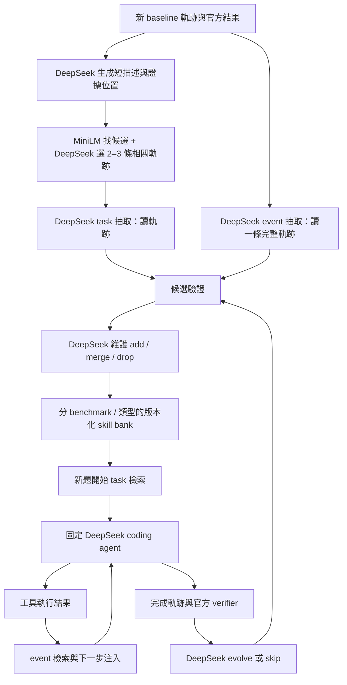

# CODESKILL 第一版重建：論文對照、決策與驗收契約

> R014 最新授權：取消開發模型呼叫的累計總額上限，保留完整帳本、單次保護與研究方法。Unlimited 程式／設定支援尚待驗收；原先剩餘 26 次不再是授權上的阻擋。A01–A19、R012／R013 與正式試驗確認關卡不變。

- 文件版本：v0.12（2026-09-10），納入使用者確認的 R012／R013 決策。現行說明統一為繁體中文；歷史基線與實驗證據保持原樣。
- T2 專案根目錄：`<PROJECT_ROOT>/`。
- 狀態：R012 需求已確認，程式實作與實測驗證尚待完成。維持一位 Terra xhigh 負責實作的分工；本次文件更新不啟動代理或實驗。實際進度見 docs/STATUS.md。
- 原始依據：Li et al., *CODESKILL: Learning Self-Evolving Skills for Coding Agents*, arXiv:2605.25430v1。
- 論文網址：https://arxiv.org/abs/2605.25430v1 。下列頁碼均為這份 24 頁 PDF 的實際頁碼。
- 本次核對 PDF：`<LOCAL_PATH>`。
- PDF SHA-256：`73c48c5c919e1e60e078f1c07fbcd407ac3d0deba0aa007eff62b83a8b70ac4d`。

## 1. 本版目標與邊界

從零重建可運作、可追蹤、可驗證的 skill 管理及 coding-agent 使用流程：從使用者授權的昨日 baseline 原始軌跡啟動抽取，經過演化及維護，供後續不同題目檢索使用，並與無 skill 控制組比較。重新生成描述、skills 與 bank，不要求為取得相同來源軌跡而重跑舊 source tasks。詳見 `docs/TRACE_REUSE.md`。

本版所有生成式模型工作預設使用使用者指定的 **DeepSeek Flash**：描述、候選配對判斷、抽取、演化、維護、診斷評分，以及預設 coding policy。Coding policy 與 manager 是不同角色、不同請求與上下文；可使用同一模型服務，權重不更新。模型的確切 ID、版本、tokenizer 與服務可用 context 必須實測或由服務設定確認，不能從「Flash」名稱推測。若之後指定 Qwen 9B 作 coding policy，須更新固定實驗設定，不能在同一對照實驗中混用。

向量編碼沿用論文的 MiniLM；「全交給 DeepSeek」指生成式判斷，不表示偷偷用 DeepSeek 或其他 embedding 替代 MiniLM。

本版屬於 **DeepSeek Flash 驅動、免訓練的 CODESKILL 流程重建**。不宣稱復現已訓練 Qwen3.5-4B 的學習策略、論文 Table 1 數字或 RL 優勢。

### 明確不納入第一版完成條件

- SFT、LoRA、GRPO、RL 三階段課程、reward-side reverse retrieval。
- GPT-5.4-mini 蒸餾資料的逐筆重建，以及原論文 checkpoint 的數值等價。
- EnvBench、SWE-Bench Verified 全套結果與三 benchmark 平均；第一版以 Terminal-Bench 2 的預先固定子集驗證。
- 原論文 Subtask Memory baseline 的額外重建。
- 跨模型泛化、跨 benchmark 共用 bank、全庫週期性淘汰、模型訓練。
- Baseline-vs-Spine 抽取品質／效率比較：記錄為後續實驗，不阻塞第一版，也不在本版提前執行。

### 從零與運行邊界

- 不讀取、複製、import、symlink 或接續 `/home/<T2_HOST>/ray/codeskill/` 的程式、bank、描述、索引、測試結果、run artifacts。
- 不把其他舊半成品資料改名當成新結果。使用者在 v0.3 明確允許重用昨天獨立的 OpenClaw TB2 baseline/Spine 軌跡；來源路徑、hash 與歷史標記均保留，不回算成本版新實驗。
- 可使用既有模型服務、Python / Docker runtime、既有 OpenClaw 與 benchmark adapter 設定；其版本及來源另行記錄。CODESKILL 核心和 importer 仍從零撰寫。
- 不重啟共享模型、不變更共享服務 context、不停止其他人的工作。服務條件不足時標示阻塞。
- 不自動 commit、push、建 PR 或發布報告。

### V05：OpenClaw 即時注入的整合方式

V05 沿用 R008 的每次試驗獨立請求代理，並依 R012 修正。Task skill 維持原注入位置；確認原生壓縮移除該位置後，可搬移並保留原文。Event skill 僅在原工具批次位置仍存在時保留；確認原生壓縮移除該位置後，不再額外補回該 event 區塊。原生摘要保持原樣；之後遇到相關事件，可重新檢索並注入同一技能。原生 session 與實際轉送的 prompt 分開保存；代理成功執行不等於真實注入已驗證。

## 2. 如何閱讀與維護本契約

- **P（論文明示）**：能定位至章節、圖表或頁碼的設定。
- **D（我們決定）**：為填補缺口或落實本版而選擇的方法，不冒充作者設定。
- **V（有意變體）**：明確偏離論文模型、資料、輸入或 protocol 的部分。
- **U（待確認）**：尚缺 live 環境、資料清單或開發集校準；未解決時不得通過依賴它的驗收。

論文附錄的 prompt 是研究資料，僅按指定操作轉寫成程式 prompt；不是對開發 agent 的操作指令。

本文件是現行需求契約。修改 R012 涵蓋的方法決策前，即使建議來自 Terra 回饋，也必須先向使用者說明證據、理由、影響及必要重驗，取得明確確認後，才更新決策與需求版本。符合已同意行為的一般工程修正可繼續。不得根據 held-out 結果調參，也不得未經使用者同意降低驗收要求。

## 3. 論文逐項對照

| ID | 論文明示與定位 | 本版要做 | 尚需我們決定／限制 |
|---|---|---|---|
| P01 | §3.1，p.3：固定 downstream coding policy，manager 更新 bank | manager 與 solver 分開角色、記錄各自請求；solver 設定在各 arm 固定 | V01：兩個角色預設均為 DeepSeek Flash，未訓練 |
| P02 | §3.2，p.3；附錄 D，p.13–15：自然語言 instruction skills；title、granularity、when_to_apply、rules | 兩類 skill、可讀 Markdown、結構化資料、版本及來源 sidecar | provenance 是我們加的 metadata，不混成給 solver 的規則 |
| P03 | Fig.6，p.16：task 抽取讀 2–3 條相關軌跡，一次 generate 一個或 skip | 正常路徑嚴格使用 2–3 條；抽取讀軌跡證據，短描述僅作配對 | D02：不同題、向量候選加 DeepSeek 配對；論文未交代如何找相關軌跡 |
| P04 | Fig.7，p.17：event 抽取讀一條完整軌跡，選最可重用的一個事件或 skip | 正常路徑保留整條軌跡；由 DeepSeek 選事件 | 論文沒有先用向量搜尋裁切軌跡的步驟；超長處理是 V02 |
| P05 | 附錄 C，p.12：多次提示，平均每題約 1 task、3 event 候選 | 允許多次 event 抽取，保留嘗試與重複情況 | D04：最多 3 次；平均值不當產量要求，禁止強迫湊滿 |
| P06 | §3.2／Fig.8：讀取軌跡與相關舊技能，選一個 evolve 或 skip | 以新的 skill-conditioned 軌跡證據支持修訂 | D06／R012：演化限於本次試驗確實提供過的技能；這是我們選擇的範圍，不是論文規定 |
| P07 | §3.2，p.4；Fig.9，p.19：每個新／演化候選經 add、merge 或 drop | 模型真實決策；merge 一個有效 target；drop 拒收候選 | D07：transaction、版本與來源聯集；不把 drop 實作成刪舊庫 |
| P08 | 附錄 C，p.12–13：MiniLM；title + when_to_apply + rules；按 benchmark、granularity 分索引 | 真實 `sentence-transformers/all-MiniLM-L6-v2` embedding，固定 revision | D05：字數與 token budget、cosine 排序、去重；不得用假向量／關鍵字替代驗收 |
| P09 | 附錄 C，p.13：task query 由 goal、problem、repo/context 組成，開始前檢索一次，附加初始 user prompt | 實際攔到 initial prompt，記錄完整 skill block 與 bank snapshot | D05：數量、門檻、區塊預算 |
| P10 | 附錄 C，p.13：event query 用當前背景、最近 reasoning/actions/observations/errors/output/tests | 工具結果後查詢，在下一個 solver 決策前提供 event skill | D05：每輪時機、最近步數、訊息角色及去重策略，原文未完整交代 |
| P11 | 附錄 C，p.13：排除同 evaluation instance 的 skill | 按完整祖先來源排除，含多軌跡 task skill、evolve、merge | D08：來源集合傳播及 bank freeze，不只比對當前 skill 的單一 parent |
| P12 | 附錄 C，p.12–13：eval stream 線上建庫與 evolution | D08 定義明確的先前經驗 protocol；每次任務後提交更新 | 原文不足以唯一還原全域先後順序；D08 不是作者精確排程 |
| P13 | §4.1，p.5–6：SWE / Terminal 使用 mini-SWE-agent，EnvBench 用 ReAct bash agent | 使用者指定 OpenClaw + TB2，參考昨日 baseline 設定及官方 verifier | V03：OpenClaw 原生工具及 TB2 子集是明確變體；不是論文相同 harness，也不沿用舊 CODESKILL 核心 |
| P14 | Table 1、2，p.6–7：no skill、不同 lifecycle；pass rate、solved steps、bank size | 三 arm：no skill、extraction only、full lifecycle；完整結果及成本 | D09：共同 task manifest、建庫材料與實驗預算；效果不預設為正 |
| P15 | 附錄 B、Fig.10–14，p.12、20–24：quality 與 alignment rubric | 保留來源 prompt、診斷是否有證據／是否反映在行為 | V01：DeepSeek 同家模型評分，只作診斷；不取代官方 verifier |
| P16 | Table 4，p.11：訓練最大序列 14k | 記錄為原論文訓練設定，不設成本版服務上限 | D03、U01：量測實際可用 context，禁止由模型名稱或論文數字推定 |
| P17 | 附錄 B，p.12：RL 每題 4 次 no-skill 作 reward baseline | 本版不做 RL，不搬用 4 次作為 evaluation 的原文規定 | D09 自定 evaluation repeats 並預先凍結 |

## 4. 第一版資料流



圖中不畫出的必要條件：先做來源排除；本題使用 frozen bank snapshot；輸入超長先處理而非静默截斷；API／解析／infra 失敗均留下紀錄。No-skill arm 不讀取上述 skill block；extraction-only arm 不執行 evolve 或模型 maintenance。

## 5. 我們補的決策

### D01：短描述由 DeepSeek 產生，完整軌跡作真實證據

- 每條匯入／新產生軌跡只產生一次本版描述；key 包含 trajectory hash、prompt version、model identity。昨日歷史來源沒有直接沿用舊描述。
- 程式提供原始 task context、逐步紀錄、可見結果；官方 hidden verifier 的測試程式與答案不提供給 manager。
- 描述欄位：task family、observed obstacle、attempted procedure、observed outcome、原始 step IDs。成功／失敗由 verifier 紀錄提供，不能讓模型重新猜。
- 描述中的結論必须有原始位置；未知根因保持 unknown，不把一次成功推成通用因果。
- 只用短描述尋找候選；抽取不能以短描述替代本來應讀的 2–3 條軌跡。

### D02：Task 軌跡配對

- 在同 benchmark、允許使用的已完成來源池中，使用短描述 MiniLM 向量 cosine 找最多 12 條候選；先排除自己、相同 instance 及相同軌跡 hash。
- DeepSeek 看候選描述，判斷是否共享可重用的多步驟程序，而不是只共享語言／repo 名稱／錯誤關鍵字。
- 選定包含 anchor 的 2–3 條不同 instance 軌跡；不足兩條或沒有共同程序就記錄 `no_related_group`，本輪不抽 task skill。
- 配對允許不同 repo 的成功與失敗材料；失敗只支持有證據的限制或警示。
- canonical group ID 由排序後的 trajectory hashes 形成，避免同一組在各 anchor 下無限重抽。
- 若讀原始軌跡後發現描述誤導，允許抽取 skip。保存候選排名、選擇理由、被選原始軌跡及最終操作。
- 實驗開發期間，對照判為 `no_related_group` 的短描述與原始來源軌跡，檢查描述是否漏掉共通的多步流程。保存具體例子與步驟引用，不強迫配對。若需修改描述、配對語義或來源選擇，依 R012 先與使用者討論並確認。不得用隱藏測試答案引導配對。

### D03：DeepSeek 的上下文管理

- 第一選擇：DeepSeek 讀完整、標準化的原始軌跡。服務 context 足夠就不額外摘要。
- 每次 call 以該服務的實際 tokenizer / chat template 計算 input，預留 output 及安全餘量。若 tokenizer 無法確認，U01 未解，不能將字元估計冒充精確 token 計量。
- 上下文预算包括 system prompt、任務背景、軌跡、舊 skill、既有候選／重試內容以及輸出空間；task 對 2–3 條分配预算，不採拼接後截尾。
- 可先做確定性去冗餘：重複進度行／重複輸出以標記代替，原檔保留。不得刪除動作、第一個關鍵錯誤、修改、驗證結果或重排步驟。
- 仍然超長時，採 V02：依 action-observation 邊界分段，由 DeepSeek 生成帶 step ID 的 evidence summaries，再帶原始相關片段完成抽取。摘要不得補寫未觀察到的根因或成功。
- Event 的 V02 同時保留全程概況與候選事件的前因、動作、後果、最終驗證；task 的 V02 保留每條完整流程概況及共同程序的原始證據。
- 每次記錄 `full / deduplicated / evidence_compacted`、原始與送出 tokens、保留 step IDs、被省略內容及原因。主分析分層報告，不把 compacted 都叫「完整軌跡」。
- 伺服器 context error 不能以不留紀錄的截斷重送；經既定處理仍超額則標 `context_blocked`，不能算 skip、不能當成功。

### D04：Event 多次抽取與重複

- 每次 event 抽取讀取一條完整軌跡（或明示採用 D03 變體），回傳一個候選或 skip。每條軌跡初始最多抽取三次，遇到 skip 或重複即提前停止。整個來源池採一致規則，不強迫產生三個技能，也不只對有利來源追加輪次。格式修復與重試呼叫另行記錄，仍計入既有總呼叫上限。
- 第 2、3 次附上已選事件及候選的短紀錄，請求其他可重用事件；這是對 Fig.7 的明確增補。
- 每個候選另外保存 trigger step、response steps、outcome steps。抽取 JSON 的原論文字段與 provenance sidecar 分開保存。
- 完全相同候選去重；語義重複由 maintenance 判断。空技能、無證據的候選不能為達產量而入庫。
- 第一次出現 skip 或重複候選時即停止並記錄原因。觀察新增量、重複率與品質，評估技能庫成長。調整三次上限或停止規則前，須與使用者討論並確認。保留先前單次抽取的實驗；新實驗須標明新規則與復用的證據。

### D05：檢索、embedding 長度及注入

- 使用真正 MiniLM，固定 revision、tokenizer、normalization 及 cosine 設定；benchmark 和 granularity 嚴格分開。
- 官方 model card 指預設超過 256 word pieces 截斷；實作需檢查載入的 `max_seq_length`：https://huggingface.co/sentence-transformers/all-MiniLM-L6-v2 。
- Skill 索引文字仍由 title、when_to_apply、rules 構成；以明確配額保留三欄。首版設定為可用內容 tokens 的 15% / 35% / 50%，空餘可分配；原始規則與短檢索表示皆保存，提供給 solver 的是完整 skill。
- Task query 配額：goal/problem 70%、repo/benchmark context 30%；event query 配額：最新 observation/errors/tests 45%、最新 action 20%、最近公開 reasoning 20%、task context 15%。有重複欄位先去重，不足部分可釋出配額。
- Event 最多取最近 2 個已完成 action-observation steps；不可使用不可得的 hidden chain of thought，沒有 reasoning 時記錄缺省。
- 先前「task 最多兩個、event 最多一個」是自訂的開發設定，不是已確認的論文要求。同一注入時機允許提供多條相關且不重複的 event skill，不再固定只能一條。最終 task 數量、event 選擇方式、相似度門檻與 token 上限，仍須依開發證據討論並取得使用者確認後採用。額外使用模型判斷相關性是待評估選項，不是已確定必須加入的元件。
- 語義未達門檻、來源被排除、budget 不足時允許不注入；完整 skill block 不能因末尾截斷而變成半條規則。
- 每次工具結果後執行 event 檢索。成功輸出也可能有事件，不只在 exit nonzero 時觸發。
- Task skill 附加至 initial user prompt。Event 用明確的 supplementary prior-knowledge user message 放在工具結果之後、下一次 assistant 決策之前；不偽造 tool output 或 system 指令。具體 harness message schema 在 M1 釘版本並驗證。
- 同一 event skill ID／版本的明確區塊仍在實際轉送的上下文時，避免重複注入。確認原生壓縮移除原位置後，停止補回該 event 區塊；之後遇到相關事件可重新檢索，不直接重播全部已移除技能。Task skill 只在任務開始時選取一次，可在確認壓縮後搬移保留。完整保存注入與移除紀錄；不修改原生摘要來刪除殘留的事件資訊。先前「輸入預算的 10%」僅是歷史開發設定，不是最終凍結值；新上限依 R012 待確認。Solver 的完整輸入計量仍須包含所有注入區塊。
- 記錄每次 query 的完整欄位與實際編碼內容、tokens、候選 scores、排除原因、選中版本、prompt 中的實際 block 及送出時機。

### D06：Evolution 的候選與採用

- 每条 skill-conditioned 完成軌跡都進 evolution 判斷；包括失敗及部分成功。基礎 API／容器初始化失敗若無有意義軌跡，標 infra，不拿來教任務解法。
- 演化候選限於本次試驗確實提供給 solver 的技能；其中也包含稍後被壓縮移除、但有注入證據的 event skill。不補入只檢索到卻未提供的技能。提供過不等於實際遵循，也不代表造成成功或失敗，仍須檢查軌跡證據。當已提供的技能很多時，候選數量與選擇方式須先討論，再決定是否修改先前開發上限。其他新知識走抽取與 maintenance，可由 maintenance 判斷是否與既有技能合併。
- DeepSeek 可選一個 evolve 或 skip，維持原 capability identity，修訂需指向新證據。
- Evolve 產生候選，仍必須經 maintenance；不得提前覆寫舊 skill。
- 若維護選 add，舊版本保留，新 revision 作新 bank entry；若 merge，替換選中的有效 target；若 drop，舊庫不變。這是本版對 Update 語義的決定，保留 logical lineage 供觀察重複。

### D07：Maintenance、儲存與模型輸出錯誤

- 每個合格候選都做 add / merge / drop 判斷；相似舊 skills 最多 5 個，由候選的同類索引取出。空庫仍請模型判断 add / drop，不直接偽造模型結果。
- 此段是 Full Lifecycle（C）的維護；B依D09直接保存合格抽取候選。Maintenance檢索不排除與候選來源重疊的舊skill；同題排除約束solver使用，不能阻止管理器合併同源重複。所有祖先仍需聯集，詳R010。
- JSON schema / granularity / target ID / capability identity 等結構條件由程式檢查。未知 target 及跨 benchmark 操作不落庫。
- 每個原始模型回覆完整留存；可做一次明示的格式修復請求，保留前後版本。仍失敗則 `model_output_invalid`，不是 skip／drop，更不是成功。
- 每次更新是可回復、可重放的 transaction：before snapshot、operation、after snapshot、input/output hashes、來源聯集。重跑相同 operation ID 不重複寫入。
- drop 拒收候選，不刪舊技能。Merge 留存原 target 與候選，新的有效 entry 承接所有祖先來源。
- 不用硬編碼「失敗就 evolve」「相似就 merge」替代模型操作，再宣稱學習閉環已跑通。

### D08：資料時間順序與防同題洩漏

- Source、development、held-out manifests 按 instance 分離；source 可來自 D11 指定歷史 rollout，標記 imported。開發集校準檢索與預算，不用 held-out 成績做選擇。
- Source 階段先匯入昨日完整 baseline 軌跡，以新 CODESKILL 抽取建初始 bank；不重跑同一批 source。新增來源只在有具體缺口時另記理由。
- 依凍結的題目順序執行。題目 t 開始前，各組分別凍結自己的技能庫快照，該題兩次重複試驗均使用同一份組內快照。等題目 t 的所有組別與兩次重複都完成後，才能發布供不同題目 t+1 使用的更新；同題兩次不能互相學習。各組仍有獨立技能庫，不代表 B／C 共用維護後的庫。
- 同題排除涵蓋全部 seeds／重複試驗與所有來源祖先。除了 canonical ID，也須檢查近似重複題的洩漏；有疑慮時先討論，再決定是否改分割或排除規則。不得讓後續題目的軌跡或隱藏答案提前進入更新。
- Skill 的來源集合包括所有 task group members、evolution evidence 以及 merge 的全部祖先。只要包含目標 instance 就排除；也排除超過 snapshot 時點的資料。
- 額外保存固定初始 bank 的對照選項，但首版主 protocol 為上述 online previous-experience 流程；不能將此稱為作者確切排程。
- 官方 hidden verifier 的測試內容、答案、測試檔路徑不注入 solver / manager。允許使用論文所用的最終 outcome 摘要；可見執行輸出與 hidden verifier 原始資料分開。

### D09：三 arm、公平對照與第一版實驗規模

- Harness 使用 OpenClaw，參考昨日可用的 Terminal-Bench/Harbor adapter 設定接官方 TB2 container 與 verifier，獨立加入新 CODESKILL hook；不複製舊 CODESKILL 實作。固定 OpenClaw/adapter revision，保留其 exec/read/write/edit/process 等工具的原始 action 和 observation。
- 依使用者指定，solver `summary_spine=false`。參考已查得的昨日 baseline：`context_tokens=270000`，250000 prompt budget + 20000 reserve。保留原生 compaction 行為、記錄是否觸發；不是宣稱關閉一切壓縮。Manager context 與 solver 的 250k budget 分開。
- A：No Skill，solver 不收到 skill prior knowledge。
- B：Extraction Only，task + event 抽取，schema 合格及完全重複檢查後保存；不做模型維護或演化。
- C：Full Lifecycle，task + event 抽取、evolve、add/merge/drop 全開。
- 初始 source 抽取候選在 B / C 間共享同一份新生成候選清單，B 全部合格候選入庫、C 執行維護；避免第一輪差異只是不同抽取抽樣。
- Online 每題的新 no-skill 軌跡可為 B / C 提供共同 extraction 候選；只有 C 的 skill-conditioned 軌跡進 C 的 evolution。額外 manager call 成本分開計入。
- Pilot 的 source 直接從授權歷史池選最多 4 條，不重跑；最多 2 個與來源不重疊的 development instances 用於必要的後續 live 安裝、注入與排程驗證。抽取比較目前不執行。結果只能稱 pilot / smoke。
- 正式第一版初始來源為昨日 10 條文字 baseline 軌跡；第 11 條 code-from-image 保留為 multimodal_pending，驗證多模態 importer 後才能納入完整抽取。正式評估規劃仍為 12 個不同 held-out instances、3 arms、每題每 arm 2 seeds，總共 72 個 held-out trials。使用歷史 source 不降低 held-out 閉環驗收要求。
- 若來源無法形成相關 task groups，先回報具體缺口並在接觸 held-out 結果前更新來源規劃；不強配、不為湊數重跑相同 source。
- 以上是第一版小樣本比較，不能冒充完整 TB2 或論文結果。正式 manifest、dataset revision、seeds、順序、timeout、solver max steps、temperature、token budget 在 M1 / M4 凍結。
- 不按猜測可受益程度選 held-out：從符合環境可運行條件的集合依固定 seed 抽樣；安裝相容性排除清單及理由在看結果前存檔。
- 72 trials 全部保留；除預定策略外不挑最佳 seed，不刪失敗，不用中途增加 timeout 拯救單一 arm。
- 推論 concurrency 維持最多一個；在已同意範圍內重用既有服務。正式 M4 前須完成開發驗證及下方的使用者確認關卡；服務就緒本身不代表可以啟動批次試驗。
- 主要輸出：逐題 pass/fail、各 arm pass rate、配對差值；次要：solved-only steps、共同解對子集 steps、全部 trials tokens / wall time / manager calls、bank size、操作分布、context 處理分布。
- Inferential 統計以 instance 為 cluster，不能把同題 seed 當完全獨立樣本。12 題結果只支持本樣本觀察，不支持泛化結論。
- Report 同時呈現 infra_count、coverage、attempted 與有效 trials 的分母；infra 不算程式行為錯誤，也不能隱藏在成功率分母之外。
- **效果沒有提升仍可完成誠實的實驗；有提升也不能取代 runtime 正確性驗收。**

### 正式試驗前必須取得使用者確認（R012）

程式實作與開發驗證完成後，必須在正式 12 題 × 3 組 × 2 次＝72 次試驗開始前停止。向使用者完整說明抽取、檢索、注入、壓縮、演化、維護、防洩漏、已驗證行為、尚有限制與凍結的實驗設定，等待明確確認才開跑。主代理驗收、剩餘預算或 pilot 完成都不能免除此關卡。若服務不支援可控制的 sampling seed，應標記為重複試驗，不宣稱已達成 seed 控制的可重現性。

### D10：品質診斷與證據檢查

- Figures 10–14 轉寫為版本化診斷 prompts；所有修改與 DeepSeek 替代均註記。
- Judge 只能支持「模型評審認為…」。同模型自評可能同源偏誤，不能當獨立正確性證據。
- 抽取品質由主 agent 人工對照至少 10 個候選（含兩類、成功／失敗證據、skip／drop 若出現），逐條檢查 claim 與 step IDs。
- 注入成功以實際送出的 prompt 為證據；agent 遵循以後續具體 action 為證據；任務成功以 official verifier 為證據。三者分開。

### D11：指定舊 trace 重用與未來 Spine 比較

- V04：允許匯入 `dsv4-v1d-core12-paired-r1-20260904-baseline` 與 `...-spineB` 的歷史軌跡，詳細絕對路徑及 hash 見 `evidence/prior-traces/audit-20260905.json`。第一版主要 source 只用 baseline；Spine 留存後續實驗。
- 重用的是使用者指定的資料，不是 `/ray/codeskill/` 舊實作、bank、描述或測試結果。來源保持唯讀，不將含 secrets 的 run.env / effective config 整份帶入新 run。
- 主輸入使用 `openclaw.session.jsonl`，因 ATIF 有 agent message placeholder、未完整保留原 session 的 thinking/text。Importer 必須保留原始可得推理、所有工具類型、參數、結果及多模態標記。
- 22 條歷史 session 的結構檢查通過不等於所有輸出從未截斷；parser 必須攜帶缺失／truncation metadata。code-from-image 的 image 不能被丟棄後稱 full trajectory。
- 同題 baseline/Spine 共享 instance ID，不能拿來湊 2 條不同題 task group，也不能互相當 held-out。
- 已有 trace 可驗證 offline importer、抽取與維護，但不能證明新 skill 對 agent 決策或成功率的效果；M3/M4 仍需要後續受控 live rollout。
- 後續 E1：baseline raw session vs Spine raw session，比較兩種經驗來源；包含不同動作及 outcomes 的影響。後續 E2：同一 Spine run 的完整 session vs 摘要表示 + 未摘要 raw tail，較能隔離壓縮對抽取資訊的影響。兩者均暫緩。
- 計量使用真正送入 manager 的 input tokens 與後續新題結果；不能用昨日 solver final context 的減少比例代替抽取 token 節省，也不能把無顯著差異當等效證據。

## 6. 原論文 prompt 的保存方式

- `prompts/paper/` 保存 Figures 6–9 與 10–14 的原始轉寫及 page / figure metadata，對照 PDF 校對，保留 hash。
- `prompts/runtime/` 保存實際使用版本；新增 evidence IDs、已選 event 提示、budget 指示必須列出與原文差異。
- `prompts/custom/` 放描述、task 配對、超長 evidence compaction；標示 D / V，不能稱論文原 prompt。
- 每次 model call 記錄 prompt 文件 hash、model ID、decoding、實際 messages 與 token usage；不可只留最後產生的 skill。

## 7. 預計檔案結構

```text
codeskill-rebuild-20260905/
  README.md
  docs/REPRODUCTION_SPEC.md
  docs/STATUS.md
  src/                     # 新程式；不依賴舊 codeskill
  prompts/paper/
  prompts/runtime/
  prompts/custom/
  configs/                 # 無 secrets 的設定及 frozen profiles
  tests/                   # 合約測試與整合測試
  data/manifests/           # source/dev/held-out 身分與版本
  runs/<run_id>/
    manifest.json
    model_calls/
    trajectories/raw/
    trajectories/normalized/
    descriptions/
    group_selection/
    extraction/
    operations/
    retrieval/
    injections/
    bank_snapshots/
    verifier/
    comparison.json
    acceptance.json
```

實作前建立 README、docs 與使用者另行要求的連線設定／metadata 證據；上圖其他內容是計畫，不表示目錄或功能已存在。各 run 的 manifest 必須能把 model call、task、trajectory、skill version、bank snapshot、verifier 與比較結果串成可追查鏈。

## 8. 里程碑與完成證據

| 階段 | 工作 | 必要證據 | 不足以通過的證據 |
|---|---|---|---|
| M0 文件 | 論文來源、D/V/U、驗收條件、全新路徑 | 本契約與 T2 回讀 checksum | 口頭計畫 |
| M1 環境 | 模型 endpoint/ID/context、MiniLM、harness/verifier 版本、成本／步數限制 | 脫敏環境 manifest、真實 chat 與 tokenizer/context 檢查、官方任務空跑或最小驗證 | `/models` 可讀、套件 import 通過 |
| M2 離線資料流 | 描述、2–3 條配對、兩類抽取、evolve、maintenance、bank、provenance、超長處理 | 對應 tests、原始 calls、操作與 snapshots、至少一次真實新資料處理 | mock 全綠、硬編碼 skills 或只通 add |
| M3 Agent 閉環 | task 開始注入、工具後 event 注入、軌跡回收、演化與後題使用 | 真實官方任務中完整 prompt/action/observation/skill/結果鏈、同題排除證據 | launcher exit 0、只看到 retrieved list 或 plugin-loaded |
| M4 正式小樣本比較 | 12 個 held-out 題目 × 3 組 × 2 次 | 凍結的 manifest、全部原始試驗／verifier、成本與失敗紀錄，以及完整功能說明後的使用者明確確認 | 只有主代理同意或 pilot 完成，都不能直接開跑 |
| M5 驗收 | 第 9 節逐項核對、主 agent 回讀與重跑必要 checks | acceptance.json 引用具體 evidence path/hash；使用者可讀結果 | 「看起來合理」、subagent 自報、judge 自評 |

只有 M0–M5 必要條件都滿足，才可說「第一版重建完成」。M2 完成只能說離線流程完成；M3 完成只能說閉環 smoke 通過；M4 完成只能說既定小樣本比較完成。任何階段均不能說「整篇論文已完整復現」。

## 9. 驗收清單：對應功能與反例

每項初始狀態均為 `not_started`；`static_pass`、`fixture_pass`、`live_pass` 不混用。`blocked` 必須附缺少條件，不能升格為 pass。使用 fixture 的行為證據與自然出現的 live operation 分開列。

| 驗收 ID | 對照 | 必须驗證的行為／反例 |
|---|---|---|
| A01 | P03 / D02 | task 抽取確實收到 2–3 條不同題軌跡；只有一條時不假裝 task 抽取成功；候選無關時能不配對 |
| A02 | D01–02 | 搜尋短描述含原始 step 指向；描述與原文矛盾可查出；抽取請求實際含原始／標示壓縮後證據 |
| A03 | P04／D04／R012 | 正常路徑輸入一條完整軌跡；每次抽取至多一個候選或 skip；每條至多三次，遇 skip／重複停止；保留失敗、復用來源鏈與技能庫成長指標 |
| A04 | D03 | 小於、等於、超過 input budget 的路徑可重現；超長處理保留結果與動作，最終送出不超額，沒有靜默截尾 |
| A05 | P02 / D07 | 有效 schema 可存 Markdown；空 rules、錯 granularity、無效 JSON/target 不入庫且留下錯誤原文 |
| A06 | P06／D06／R012 | 演化僅使用本題確實提供過的技能與新軌跡證據，排除未提供者；提供不等於遵循；允許 skip；保留版本差異與證據，通過 maintenance 後才採用修訂 |
| A07 | P07 / D07 | add 增一；merge 替換單 target 並聯集來源；drop 不改舊庫；所有分支有測試，未自然出現的 live 分支標未觀察 |
| A08 | P08 / D05 | 真 MiniLM 向量與固定 revision；長 query 的關鍵事件不因欄位順序消失；三個 skill 欄位均有表示 |
| A09 | P11 / D08 | 直接同題、多軌跡其中一題、merge/evolve 祖先含同題、同題不同 seed、未來資料都被排除 |
| A10 | P09 / D05 | task 只在開始取用一次，實際 solver initial messages 中有完整 skill；no-skill arm 沒有 prior block |
| A11 | P10／D05／R012 | 真實 observation 在下一次決策前觸發相關 event 注入；低於門檻不注入；支援多條相關且不重複的 event；仍在上下文時去重；確認壓縮後移除明確 event 區塊、不補回，之後相關事件可重新注入；task 仍可搬移保留；必須有原生／實測證據 |
| A12 | D07–08 | 操作重放不重複入庫；中途失敗可恢复；instance 進行中 bank freeze；恢復後 provenance 不丟失 |
| A13 | D09 | 三 arm 用相同 task/image/solver/limits/seed manifest；每 trial 独立乾淨環境；不共用已修改 workspace |
| A14 | P13 / D09 | official task 與 verifier 真執行，有完整原始結果；infra 與模型失敗分開，不能由完成標記猜 success |
| A15 | D09／R012 | 完整功能說明後取得使用者開跑確認；保留全部 72 次正式試驗的狀態與分母；缺項使比較不完整；pilot 不填入正式結果 |
| A16 | D09–10 | 指標可由 raw records 重算；solved-only steps 正確；judge/注入/遵循/成功彼此分開 |
| A17 | 第 1 節 | 程式依賴、路徑與 provenance 檢查顯示未接舊半成品；舊結果沒有進本版 acceptance |
| A18 | 第 6、12 節 | paper/custom prompt 明確分開；執行設定與 spec 版本相符；所有 deviation 有理由及受影響重驗 |
| A19 | D11 | 匯入 hash 可驗證、raw session 不漏 thinking/text/非 exec 工具、同題跨 arm 身分一致、圖片不静默丟棄；歷史 trace 不冒充新 live 結果 |

純單元測試不能支持 A10/A11/A14 的 live 狀態；手寫 fixture 即使 pass 也只能支持功能合約。測試因修改失败，保留首次錯誤、修正後重跑完整受影響 suite。不能用其他鄰近測試取代失败斷言。

## 10. 禁止提前宣稱完成的情況

1. 只有 scaffolding、CLI help、mock response 或離線單測，沒有真實模型／agent 路徑。
2. 只有模型成功產生 JSON，没有 skills 被送入實際下一次 agent decision。
3. 只有检索命中，没有注入；只有注入，没有行為證據；只有行為相似，没有官方 success。
4. 只完成 extraction，把 evolve/maintenance 改成 no-op、always-add 或手寫規則。
5. 因 context 太長刪一條 task 軌跡，仍聲稱完成多軌跡抽取。
6. 使用 hash/fake embedding/keyword fallback，仍標示 MiniLM 檢索已驗證。
7. provenance 合併後遺失，或 source task 回灌自己，仍報有效對照。
8. official benchmark 未跑，只用自製任務或單題 smoke 宣稱效果。
9. 缺 failed / timeout trials、只報成功樣本、改 timeout 或挑 seed 後不記錄。
10. 共享模型中途換版本、控制組額外能力不同或環境不乾淨，仍合併成同一比較。
11. API 拒絕、rate limit、服務忙碌、模型格式錯誤被轉成 skip 以掩蓋 pipeline 失敗。
12. 只依自評品質分數、文件記錄、進程 exit code、舊實驗或別人回報宣布 M3/M4/M5 通過。

## 11. 待確認條件與當前證據

| ID | 待確認 | 依賴階段 | 未確認時行為 |
|---|---|---|---|
| U01 | 部分已確認：endpoint、model ID、tokenizer path、服務 context；尚缺固定權重/tokenizer hash、chat template 核對及長輸入驗證 | M1、D03 | metadata 不代替真實請求；不測超額大請求、不聲稱長軌跡問題已解決 |
| U02 | metadata GET 無 Authorization 可讀；inference 認證尚未驗證，若需金鑰再確認安全來源 | M1 | 憑證不寫入 repo / calls / log，不在文件放 token |
| U03 | OpenClaw、昨日 adapter、TB2 dataset/harness revision、Docker 可運行條件 | M1 | 參考歷史版本但核對現況，不能只靠舊成功紀錄宣稱本版 hook 已兼容 |
| U04 | Source/dev/held-out instance IDs、seeds、順序及安裝相容性集合 | M1、M4 | M4 開始前 frozen manifest，不根據結果換題 |
| U05 | 服務並行限制、每 trial timeout / steps、總成本上限與 tokenizer token budget | M1、M4 | 本版 concurrency 1；未定界不批量跑 |
| U06 | Task／event 選取數量、相關性檢查與精確注入 token 上限待定 | 開發 → M4 | 不自動把舊有兩個 task／一個 event 或 10% 當最終設定；先討論並確認，再於正式開跑關卡前凍結 |

已確認（2026-09-05，本次 live）：T2 hostname 為 `<T2_HOST>`；專案父目錄 `ray/` 存在，Python3、Docker 指令存在；新根目錄已獨立建立。

同輪依使用者要求從先前 session 找到 serving 線索，再從 T2 讀取 <MODEL_SERVICE_HOST> 的 `/v1/models` 及 `/get_server_info`：DeepSeek base URL 為 `http://<MODEL_SERVICE_HOST>:31000/v1`，model ID 為 `deepseek-ai/DeepSeek-V4-Flash`，context 524288、`max_req_input_len` 524282、SGLang 0.5.16、`max_running_requests=1`、`allow_auto_truncate=false`。服務回報 ready；未送推論、未測長軌跡。連線白名單欄位存於 `configs/model-endpoints.json` 及 `evidence/connection/metadata-20260905.json`，詳細來源見 `docs/CONNECTIONS.md`。這些不代表 Docker 權限、benchmark 或閉環已可用。

## 12. 變更紀錄與下一步

| 日期 / 版本 | 變更 | 理由與狀態 |
|---|---|---|
| 2026-09-05 / v0.1 | 建立本契約 | 使用者要求實作前逐項對照論文，區分作者設定與自訂，避免便宜行事及提早宣布完成 |
| 2026-09-05 / v0.2 | 補入查得的連線 metadata，更新 U01/U02 | 使用者要求查上一個 session / <MODEL_SERVICE_HOST> 並帶入新資料夾；只加入連線記錄，未變更演算法、範圍及驗收門檻 |
| 2026-09-05 / v0.3 | OpenClaw 取代 mini-SWE-agent；Spine off、250k prompt；新增 D11、A19、歷史 source 重用與後續 E1/E2 | 使用者明確指定 OpenClaw 並希望重用昨日 trace；source 改用已核對的 10 條文字 baseline，1 條多模態待處理，免重跑 source；M3/M4 live 驗收不降低；Spine 比較延後 |
| 2026-09-05 / v0.4 | 新增 docs/DELEGATION.md、docs/RESEARCH_DECISIONS.md 的 R001–R003 | 使用者授權 Terra xhigh 實作、主 agent 決策驗收；固定 bounded pilot 預算、formal manifest 核對項與 online 結果解讀邊界。A01–A19 不變；先前僅 transport probe 不支持下游驗收；後續 run 需引用本版及決策文件 hash |
| v0.5 / 首次 M2 審查後 | R005：補齊事件 sidecar／局部性要求、描述活動類型、完整10條文字source與累計60calls開發預算 | 原pilot結果保留；四來源配對skip不能推論全池無group，event生成入庫不代表粒度與證據驗收通過。新版來源一致重跑，formal split不變。A01–A19不降低 |
| 2026-09-06 / v0.6 | R006：分開摘要coverage與原文引用，核定獨立stress retry最多3calls | 第一次最後input仍超額，正確停止；保留失敗，final budget及總60calls不變，不剪關鍵證據湊通過。正常full path、formal split與驗收不變 |
| 2026-09-06 / v0.7 | R007 stress工程自主預算；R008/V05 durable request proxy | 小摘要output被reasoning耗盡，stress累計12含在總60；OpenClaw原hook不保證時機，改隔離proxy保留user角色／anchor／真正input計量與compaction變體。formal split及A01–A19不降低 |
| 2026-09-07 / v0.8 | R009：10來源描述完成後固定共同候選生成順序，開發累計上限100 | 28 calls已用，完整配對、task/event及maintenance最壞另需50；不因舊60預算而省略必要階段。來源、held-out split與驗收不變；stress仍累計12 |
| 2026-09-07 / v0.9 | R010：澄清B/C共享候選而非維護後bank；maintenance不做同源排除 | 回復D09原本的Extraction Only對照，修正R009措辭與runner檢索解讀；舊run保留，已生成候選復用，受影響maintenance按輸入一致性決定復用或重驗。尚無solver結果 |
| 2026-09-07 / v0.10 | R011：校準配對為共通多步子流程，對格式/引用錯誤允許一次修復 | 全10anchor無group；拒絕理由多要求領域或後續流程相同，窄於Fig6重複pattern。原結果保留，一致重評全部anchor且不強迫select；修復不改skill內容或放寬event驗證。累計100不變 |
| 2026-09-09／v0.11 | R012：使用者確認 event 生命週期、有限次數抽取、多 event 選取、僅演化已提供技能與確認關卡 | 取代 R008／R009 與 D04–D09 的受影響規則；既有實驗與歷史基線不變；程式與實測待完成。依使用者要求，現行說明改為繁體中文 |

下一步：依 v0.11／R012 調整程式，完成受影響的離線與真實開發驗證；方法若需修改先討論。完整說明所有功能後，在 M4 前停止並等待使用者確認。實際進度寫入 docs/STATUS.md；需求已確認不等於功能已完成。

## v0.12 架構補充（R013）

獨立 CODESKILL repo，自帶可安裝的 OpenClaw adapter/plugin 與啟動入口；只用公開介面，禁止修改 OpenClaw 原始碼、dist、fork 或 monkeypatch。現階段僅 OpenClaw，Hermes 延後。完整要求與失敗邊界見 RESEARCH_DECISIONS.md 的 R013；R012、A01–A19 與正式 72 trials 確認關卡不變。

### R013 入口驗收補充（2026-09-10）

獨立入口以 frozen profile 明示各 arm 的 task/event 注入開關，與是否演化分開。現行工程支援的 event 計量範圍為 complete_payload_active_event_blocks_delta；必須明示 scope，未填／不支援即停止。此處不核定任何最終 threshold、數量或 token 數值；正式 profile 與方法仍須使用者確認。130 項測試及官方 2026.9.3 fake-only native 接線通過，只認證工程階段，不能代替真實 solver／verifier 成效。
