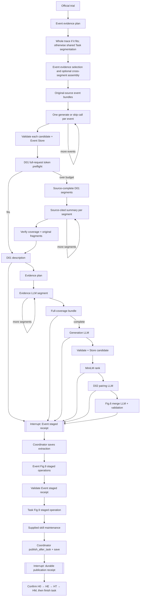

# R015 Task and Event graph runtime

The official C-only driver uses `EventGraphRunner` for Event extraction and
`TaskGraphRunner` for every learnable Task phase. Their separate stable thread
identities include the round, task, trial, source
trace, historical-thinking policy, prompts, schemas, model settings, and
tokenizer route. `SqliteSaver` checkpoints graph state; a round-shared
`SqliteStore` keeps content-addressed single-task candidates under a
round-and-method namespace. The method includes the historical-thinking
policy/version, graph version, model boundary, tokenizer, prompts, and
schemas; candidates from different source tasks can be combined only when
that method matches. Revalidation also checks each candidate's own source
trace, generation request, raw completed response, and cited bundle. A
restart reuses an identical Store record without a second write. Neither
store publishes the skill bank.

Install the pinned project extra in an isolated environment with
`python -m pip install -e ".[task-graph]"` before invoking the official
driver. No global Codex or Python configuration is needed.

The first interrupt is resumed only after the coordinator saves protocol
extraction, Event Fig.9 operations have been staged, and their bank hash has
been replayed. The driver waits for a durable extraction acknowledgement
before invoking Event Fig.9. The second interrupt checks the saved protocol
bank and exact ordered operation IDs. A complete HTTP response
is replayed from immutable wire bytes after a node restart; a sent request
without a saved response stops as `transport_uncertain` and is never resent
automatically. The adapter records actual request and response bytes, provider
usage, finish reason, latency, and exact tokenizer preflight. The formal
semantic verifier is `not_run`.

Event selection may identify several local trigger/response episodes from one
trace; a local episode can span several actions. It cites Task's exact source
handles, and code expands each handle to its original steps. The Event graph
uses Task's token preflight, `TaskChatBoundary`, `SqliteSaver`, and
`SqliteStore`. Its own prompts, schema, event state, and configurable
`max_events` setting allow up to eight events per trace by default. That
setting is a trial default, not an observed optimum. Each generation request
contains only the selected event bundle. A skip, rejected output, or length
response is recorded per event; a transport-uncertain call stops the graph.
Event evidence selection packs complete source handles into requests of at
most 65,536 input tokens by default, using exact tokenizer preflight. Every
local handle appears in one segment; a single handle that cannot fit blocks
selection instead of silently exceeding the limit. The effective segment
limit is recorded in the graph identity and can be configured with
`evidence_segment_input_tokens`.
When segment fragments exceed the configured count, assembly selects up to
the cap and records a selected, merged, or omitted disposition for every
fragment. The Event Store candidate is checked against the producing graph,
source-derived evidence and assembly requests, exact generation request,
saved call identity and complete response, source trace, and Store record
before Fig.9. The coordinator
records ordered Event attempts in `COnlyProtocol`; identical validated skill
content is recorded as a duplicate rather than published twice. Event
candidates then use the existing Fig.9 and single durable publication path.

D01 has its own bounded context path because it describes the whole task even
when Event selects no local candidate. An exact preflight sends the full D01
request when it fits. Otherwise the Task graph segments the projected source
at complete action/result boundaries, obtains one source-cited summary per
segment through `TaskChatBoundary`, and verifies complete step coverage,
original fragment linkage, the actual saved request and call identity, complete
response, source trace, policy, and method
identity before D01. Only this description input is compacted; Task and Event
skill evidence still use original source handles. A sent summary request with
no saved response remains uncertain, and a completed saved response is reused
after a process restart.

The offline recovery tests restart fresh Python processes after the evidence
bundle, a saved generation response, a SQLite Store put, durable C-only
publication, and Graph confirmation. One test uses a fixture-only Task call
and publication state. A separate test uses the production `TaskChatBoundary`
with a controlled HTTP transport, real `COnlyProtocol` extraction and
publication saves, the coordinator's Graph confirmation, and `finish_task`.
It checks one send per Task request, one candidate Store put, one bank
operation, and one publication and completion journal entry. The Event
candidate and manager response in that test are controlled fixtures; the
test does not execute Event extraction, a live model or solver, or a Task
maintenance decision. It does not establish target SGLang compatibility,
skill quality, or solver efficacy. A separate Event restart test now uses the
real Event graph, production model boundary with controlled HTTP, SQLite
Store, protocol extraction, and protocol publication. Its Fig.9 response is
controlled. The Task restart test still covers the durable Graph confirmation
between publication and `finish_task`.

The former R015 manager-only Event orchestration lives in
`scripts/legacy/r015_event_extraction.py`. An audited pre-Graph call resumes
through the explicit `scripts/legacy/run_r015_c_only_harbor_driver.py`
entrypoint, which the coordinator selects only with a reconciliation manifest.
The official driver always uses `EventGraphRunner` and rejects a reconciliation
manifest on its own entrypoint. The
former R015 manager-only D01, isolated Task candidate, and D02/merge
orchestration lives in `scripts/legacy/r015_task_extraction.py`. Its bounded
historical comparison entrypoint is `scripts/legacy/run_r015_thinking_ab.py`;
the related tests are under `tests/legacy/`. The active C-only driver retains
Fig.8/Fig.9 publication, manager evidence binding, and source helpers.
